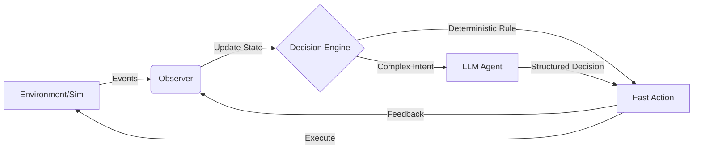

# Farz Home

> **The Generic Reality Engine.**

**Farz Home** is not just another home automation script runner. It is a **domain-agnostic autonomous decision system**.

It is designed to model, observe, and control any stateful environment—from a smart home to a server farm or a hydroponic system—using a unified, generic data model.

We prioritize **Simulation First**, **Agentic Decisions** (Goals over Rules), and **Self-Healing State**.


## 🧠 Core Philosophy

Most automation systems are **Reactive** (`IF trigger THEN action`).
Farz Home is **Reconciliatory** (`Current State` vs `Desired State` -> `Action`).

* **Generic Entities:** No hardcoded `LightBulb` classes. Everything is an `Entity` with `tags` and `attributes`.
* **Simulation First:** We build the "Digital Twin" before touching real hardware.
* **Terminal Native:** High-observability TUI (Text User Interface) for rigorous debugging.
* **Hybrid Intelligence:** Fast, deterministic rules for safety; LLM-based reasoning for complex intent.

## 🏗 Architecture

The system runs on a high-frequency **Control Loop**:



## 🛠 Tech Stack

* **Runtime:** Python 3.12+
* **Data Validation:** Pydantic (Strict typing everywhere)
* **CLI/Interface:** Typer + Rich
* **Logging:** Structlog (JSON structured logs)
* **Intelligence:** OpenAI/Anthropic via `instructor` (Structured outputs)

## 🚀 Getting Started

### Prerequisites

* Python 3.12+
* Poetry (Recommended) or pip

### Installation

1. Clone the repository:
```bash
git clone https://github.com/farz-labs/farz-home.git
cd farz-home

```


2. Install dependencies:
```bash
poetry install

```


### Usage

Run the simulation engine directly from your terminal. Farz Home uses a rich TUI to visualize the state of your "Digital Twin" in real-time.

```bash
poetry run python main.py start --config simulations/home.yaml

```

## ⚙️ Configuration (The Generic Model)

Farz Home defines the world via YAML. Because the architecture is generic, you can define a Home or a Factory using the same schema.

```yaml
# simulations/home.yaml
system:
  tick_rate: 1.0 # seconds

entities:
  - id: "living_room_main"
    name: "Living Room Light"
    tags: ["location:living_room", "type:light", "capability:dimmable"]
    attributes:
      state: "OFF"
      brightness: 0
      power_draw: 0

  - id: "garage_sensor"
    name: "Garage Door"
    tags: ["location:garage", "type:sensor", "security:critical"]
    attributes:
      state: "CLOSED"

```

## 🗺 Roadmap

* [ ] **Phase 1: The Foundation** (Current)
* [x] CLI and Logging Setup
* [x] Generic `Entity` and `WorldState` models
* [ ] YAML Configuration Loader
* [ ] Basic Simulation Loop (Entropy/Chaos Monkey)

---

* [ ] **Phase 2: Intelligence**
* [ ] LLM Integration for "Vague Intents"
* [ ] Feedback Loops (Did the action work?)

---

* [ ] **Phase 3: Real World**
* [ ] Home Assistant API Plugin
* [ ] Cron/Scheduler Plugin


## 🤝 Contributing

We are currently a small team focused on architectural rigor.

1. **Strict Typing:** No `Any` unless absolutely necessary.
2. **Simulation First:** Features must work in the sim before hardware code is written.
3. **Issues:** Please discuss in GitHub Issues before opening PRs.

---

**Farz Labs** — *Building the Operating System for Autonomy.*
